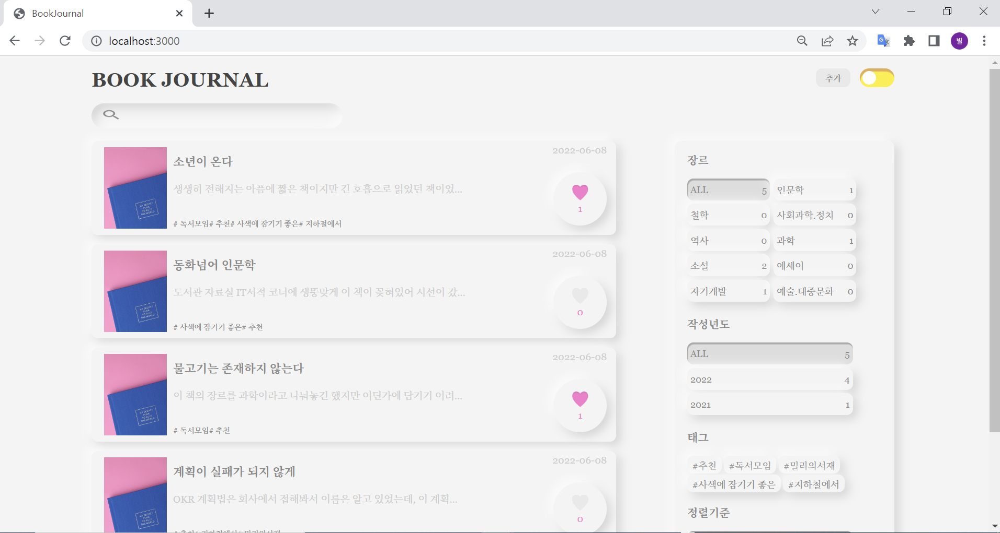
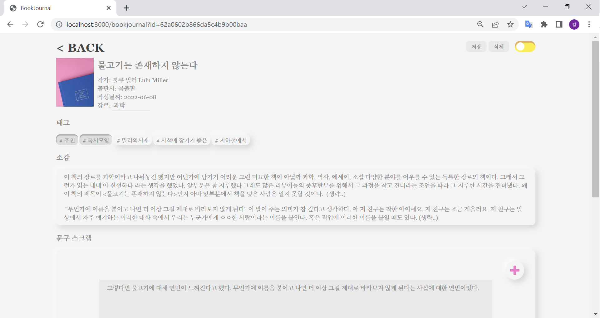

# book-journal(개발중)

## 프로젝트 시작 동기

프로그래머스 사이트에서 프론트엔드 문제를 풀어보다가, "내가 바닐라 자바스크립트로 애플리케이션을 못 만드네..?"라는 생각을 했습니다. 리액트나 뷰나 도구에 너무 익숙해져 버린 거 같다 라는 생각과 바닐라 자바스크립트로 SPA 만드는 게 원리를 공부하는데 도움이 된다라는 생각으로 시작하게 된 프로젝트입니다.

연습용 프로젝트라 디테일하게 만들지는 않고 있어요(시작은 이랬지만 지금 막상 만드니까 욕심도 애착도 생겨서 배포해서 사용해야겠다는 생각을 하면서 만드는 중이에요🤣)

🏠데모용 page 바로가기 (백엔드가 연결되어 있지 않고 기능 소개용 page입니다.)

## Stack

front-end : Vanilla JavaScript  
back-end: Node.js  
db: MongoDB

## 스크린 샷

### main page

### book-journal page

