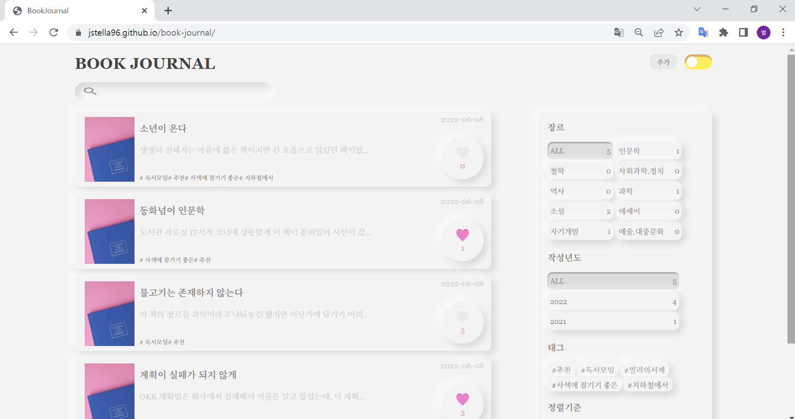
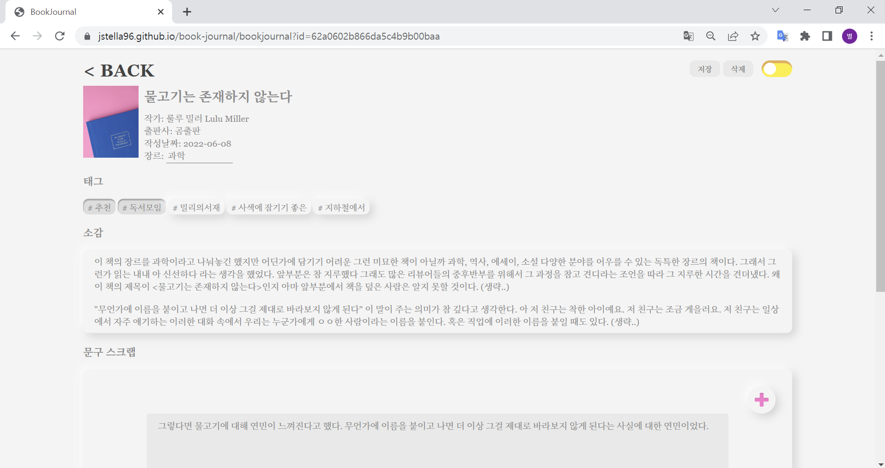

# book-journal(개발중)

## 프로젝트 시작 동기

프로그래머스 사이트에서 프론트엔드 문제를 풀어보다가 제가 바닐라 자바스크립트로 애플리케이션을 못 만든다는 사실을 알게 돼버렸습니다. "리액트나 뷰나 도구에 너무 익숙해져 버린 거 같다" + "바닐라 자바스크립트로 SPA 만드는 게 지금 사용하는 프레임워크의 원리를 공부하는데 도움이 된다"
이 두 가지 생각으로 시작하게 된 프로젝트입니다.

연습용 프로젝트라 디테일하게 만들지는 않으려 했지만 막상 만드니까 욕심도 애착도 생겨서 배포해서 사용해야겠다는 생각을 하면서 만드는 중입니다. 프론트엔드 컴포넌트 중요 구현은 끝나서 깃 헙 페이지로 소개합니다.

🚀[데모용 page 바로가기](https://jstella96.github.io/book-journal/)  
:mega: 백엔드가 연결되어 있지 않습니다. 기존 api 통신 부분 코드를 local-storage를 사용한 코드로 교체한 데모 페이지 입니다.

## Stack

front-end : Vanilla JavaScript  
back-end: Node.js
db: MongoDB

## 스크린 샷

### main page

### book-journal page

